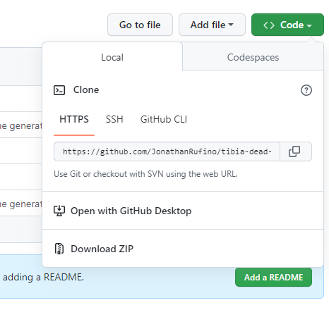
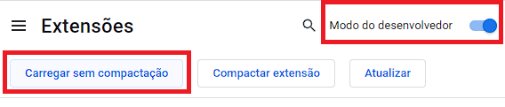
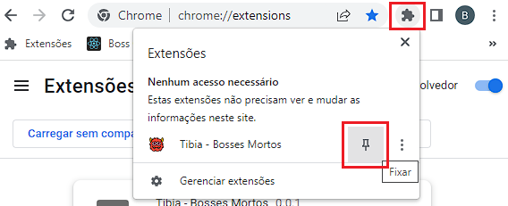
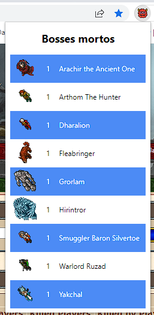

# Instalação

1. Baixe a extensão clicando em `Code > Download ZIP`.

2. Extraia o conteúdo do arquivo para um local de sua preferência.

3. Acesse a url [chrome://extensions/](chrome://extensions/) no Google Chrome.

4. Ative a opção `Modo do Desenvolvedor`, selecione a opção `Carregar sem compactação`, e selecione a pasta que você extraiu no passo 2.

5. Após a instalação, clique no ícone de extensões, encontre a extensão `Tibia - Bosses Mortos` e clique no botão `Fixar`.

# Utilização

1. Acesse o link [https://www.tibia.com/community/?subtopic=killstatistics](https://www.tibia.com/community/?subtopic=killstatistics), e selecione um mundo. `Ex.: Kalibra`

2. Após o carregamento da página clique no ícone da extensão.

> ⚠️ **Importante:** Caso você feche a janela da extensão e clique novamente, a lista não será mostrada. Para isso, recarrege a página e clique na extensão novamente.